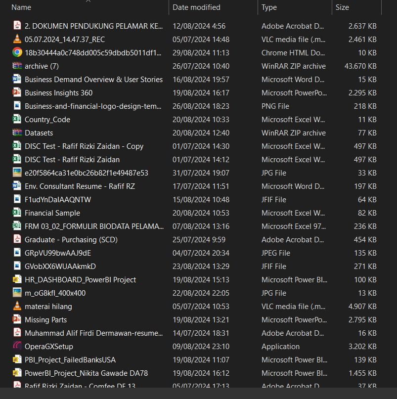
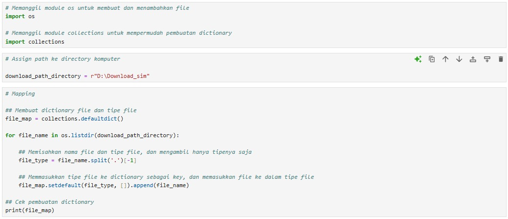
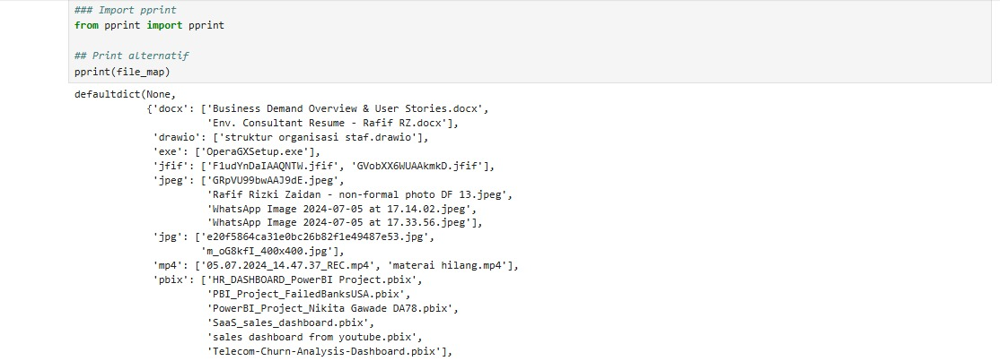
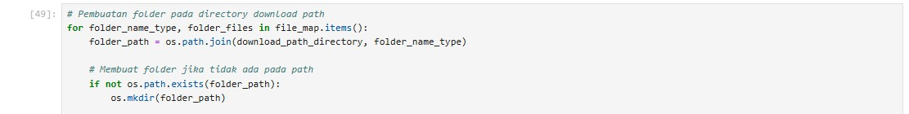
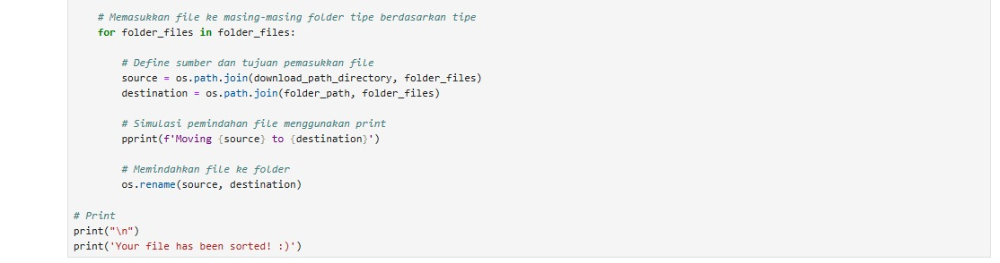
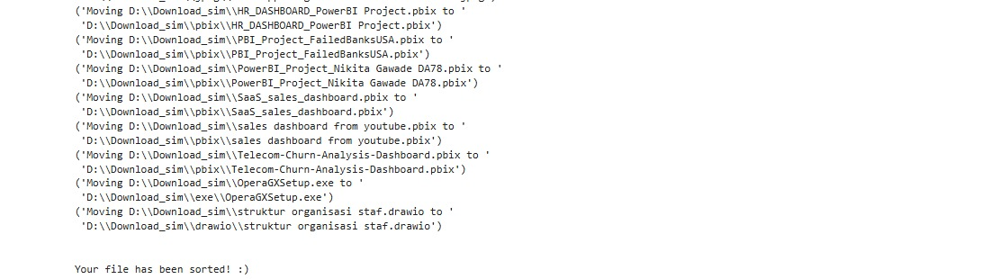
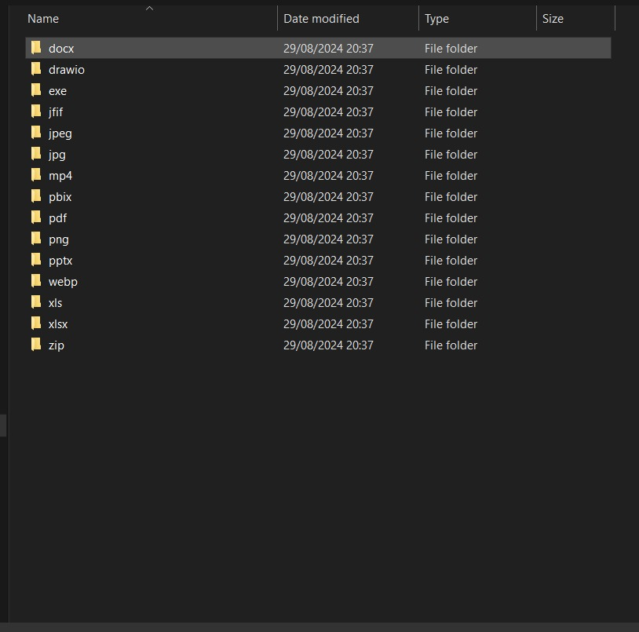

# Automatic File Sorter (Python)

## **Background**

In this digital age, we always download files from internet/application to our computer. The problem is, not everyone has the time to sort files every day. I mean, just look at my personal download directory:

 

  <kbd> </kbd>  

 
 

My download folder has 45 files. It used to be so much more (over 1000!), and honestly I've gotten tired of sorting it manually. I mean, who doesn't, right?

 

To tackle this, I look into my old friend Google, and to my surprise, you can actually use Python. So, I decided that it was time to sort the files into each folder by utilizing Python.

 

## **Preparation**

For sorting files in Python, we are going to need several modules, namely:
* **os** module: **os** is a module in Python that enables us to interact with the operating system. Essentially, we can create files, create directories, and even manage the files and directories itself. Some examples (including what are we going to use) are:
  ** os.getcwd(): Handle current directory.
  ** os.mkdir(): Create directory.
  ** os.rename(): Rename files (can also be used to place file into their respective folders.

* **collections** module: **collections** is a module in Python that helps us organize and work with your data in different ways, such as counting items or make a list where you can easily add or remove items. Examples are:
  ** Counter(): Count how many values a value appear.
  ** OrderDict(): Remembers the order of inserted value.
  ** DefaultDict(): Provide some default values for the key.

 

## **Code**

First, the modules needed was imported from the library (**os** and **collections**). After that, files were categorized by their type.

 

  <kbd> </kbd>  

 
 

Files that has been categorized then double checked to make sure the categorization went smoothly.

 

  <kbd> </kbd>  

 
 

Next step is to create the files based on category that was created before, to divide files to folders based on file type. 

 

  <kbd> </kbd>  

 
 

Finally, creating loop function to move the files based on their type. To make sure the operation went smoothly, call out print function (move 'file' to 'folder') so that we can see where the file was moved into. Then, end it with a text: Your file has been sorted! 

 

  <kbd> </kbd>  

 
 

  <kbd> </kbd>  

 
 

Let's see the final result.

 

  <kbd> </kbd>  

 
 

Et voilà, much cleaner than before. We have successfully made a mini file organizer!
